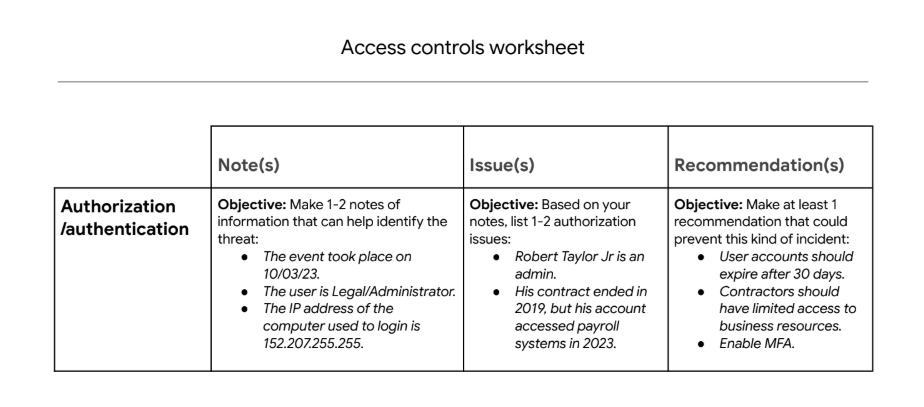
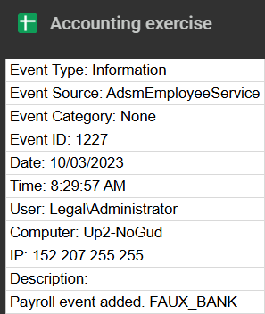
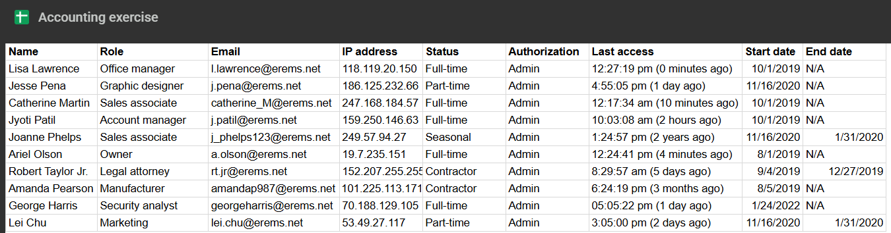

# Security Incident Investigation: Unauthorized Payment Attempt

## Scenario
I am the first cybersecurity professional hired by a growing business. Recently, a deposit was made from the business to an unknown bank account. The finance manager confirmed they did not authorize this transaction. Fortunately, the payment was stopped in time. The business owner asked me to investigate what happened and prevent future incidents.

## Project Description
Conducted a comprehensive security incident investigation involving unauthorized access to financial systems. Analyzed event logs and employee directories to identify the root cause, assessed authorization failures, and developed multi-layered security recommendations across technical, operational, and managerial controls.

## Tools Used
- Event log analysis
- Employee directory cross-referencing
- Access control auditing
- Incident response methodology

## Investigation Process

*structured investigation framework used to analyze the security incident*

### Phase 1: Incident Analysis

**Objective:** Identify key details about the security incident

**Key findings:**

**Who caused the incident:**
- User: Robert Taylor Jr.
- Role: Legal attorney (contractor)
- Access level: RBAC (Role-Based Access Control) with administrative privileges

**When it occurred:**
- Date: October 3, 2023
- Time: 8:29:57 AM

**What device was used:**
- Computer name: Up2-NoGud
- IP address: 152.207.255.255

*Event log showing unauthorized payroll transaction attempt*

### Phase 2: Authorization Issues Identified

**Critical security gap discovered:**

After cross-referencing the event logs with the employee directory, I identified a severe access control violation:

**Issue:** 
Expired contractor account with active access
- Robert Taylor Jr.'s contract ended in **2019**
- His account accessed payroll systems in **2023** (4 years after contract termination)
- Account had RBAC permissions that granted access to financial systems
- No account deactivation process was enforced upon contract completion

*Employee directory showing Robert Taylor Jr's contract ended 12/27/2019 but account remained active*

  **Root cause:** Lack of automated account lifecycle management and failure to revoke access when employment/contract status changes.

**Security impact:** 
- Unauthorized access to sensitive financial systems
- Ability to initiate payment transactions
- Violation of least privilege principle
- Compliance risk (access control audit failure)

### Phase 3: Recommendations

To prevent similar incidents, I recommended implementing security controls across three layers:

#### Technical Controls

**Automated account management:**
- Implement automatic account expiration policies (30-day review cycle for contractors)
- Deploy Access Control Lists (ACLs) to restrict financial system access to authorized personnel only
- Enable data encryption for sensitive financial data at rest and in transit
- Implement Multi-Factor Authentication (MFA) for all accounts with financial system access

**Justification:** Technical controls provide automated enforcement of security policies, reducing reliance on manual processes that can fail.

#### Operational Controls

**Human-driven security processes:**
- **Security awareness training:** Educate staff on recognizing and reporting suspicious financial activities
- **Incident response plan:** Establish documented procedures for responding to unauthorized access incidents
- **Background checks:** Conduct thorough background verification for all personnel with financial system access
- **Access review process:** Implement quarterly access audits to verify user permissions align with current job roles

**Justification:** Operational controls ensure security policies are followed in day-to-day business activities and create a security-aware culture.

#### Managerial Controls

**Governance and policy framework:**
- **Security policies:** Develop formal policies for account lifecycle management, including contractor offboarding procedures
- **Compliance audits:** Schedule regular audits to verify adherence to access control policies
- **Risk management:** Establish risk assessment procedures for financial system access
- **Separation of duties:** Implement controls requiring multiple approvals for financial transactions

**Justification:** Managerial controls provide strategic direction and accountability for security programs, ensuring security is embedded in organizational governance.

## Summary

I successfully investigated an unauthorized payment incident by:

- Analyzing event logs to identify the user, timestamp, and device involved in the incident
- Cross-referencing employee directory data to uncover a critical access control failure
- Discovering a contractor account that remained active 4 years after contract termination
- Identifying RBAC misconfigurations that granted unnecessary financial system access
- Developing comprehensive security recommendations spanning technical, operational, and managerial controls
- Proposing automated account expiration, MFA implementation, and regular access audits

**Key takeaway:** This incident highlighted the critical importance of account lifecycle management, especially for contractors and temporary staff. Without proper offboarding procedures and automated account expiration policies, organizations face significant security and compliance risks.

**Business impact:** Prevented financial loss, identified systemic security gaps, and established a foundation for mature access control practices as the organization's first cybersecurity professional.
